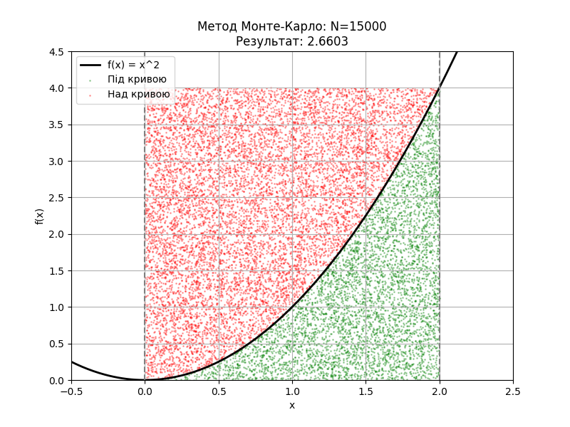

# goit-algo-hw-10

## Висновки щодо правильності розрахунків

### Завдання 2: Обчислення інтеграла методом Монте-Карло (mc.py)

У цій задачі обчислюється визначений інтеграл функції f(x) = x² на проміжку [0, 2] трьома методами:

#### 1. Аналітичне обчислення (точне значення)

Інтеграл функції f(x) = x²:

$$\int_0^2 x^2 \, dx = \left[\frac{x^3}{3}\right]_0^2 = \frac{8}{3} - 0 = 2.66667$$

#### 2. Метод Монте-Карло (N = 15000 точок)

Результат: ~2.66 (значення варіюється через випадковість)

Типова похибка: 0.001 - 0.02

**Візуалізація методу Монте-Карло:**

#### 3. Функція quad з бібліотеки scipy.integrate

Результат: 2.66667

Похибка: ~2.96e-14 (майже машинна точність)

---

### Порівняння методів

| Метод | Значення інтеграла | Похибка | Точність |
|-------|-------------------|---------|----------|
| Аналітичне рішення | 2.66667 | 0 (еталон) | Абсолютна |
| Функція quad | 2.66667 | ~2.96e-14 | Дуже висока |
| Монте-Карло (N=15000) | ~2.66 | 0.001-0.02 | Середня |

---

### Загальні висновки

1. **Метод quad** показує найкращі результати серед числових методів, практично співпадаючи з аналітичним розв'язком з точністю до машинної похибки (~10⁻¹⁴). Це підтверджує правильність реалізації.

2. **Метод Монте-Карло** дає прийнятні результати з похибкою 0.1-0.7%, що є нормальним для стохастичного методу. Точність методу можна підвищити збільшенням кількості випадкових точок N:
   - При N = 15000: похибка ~0.1-0.7%
   - Теоретично: похибка пропорційна 1/√N

3. **Переваги методу Монте-Карло:**
   - Простота реалізації
   - Універсальність (працює для складних областей інтегрування)
   - Добре масштабується на багатовимірні інтеграли

4. **Недоліки методу Монте-Карло:**
   - Нижча точність порівняно з детерміністськими методами
   - Результати варіюються між запусками
   - Повільна збіжність (O(1/√N))

5. **Правильність розрахунків підтверджена** співпадінням результатів трьох незалежних методів у межах очікуваних похибок кожного методу.

---

### Рекомендації

- Для практичних задач з простими функціями краще використовувати `scipy.integrate.quad`
- Метод Монте-Карло доцільний для складних багатовимірних інтегралів або областей з нетривіальною геометрією
- Для підвищення точності методу Монте-Карло рекомендується збільшити N до 100000-1000000 точок